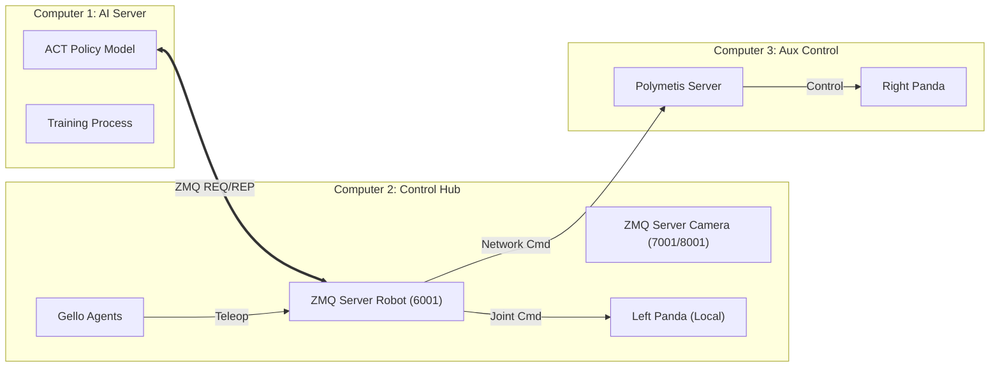

# ACT-panel-maintenance: Manipulation for Energy Facility Management

GIST, ETRI

## Abstract
This project implements a robust bimanual teleoperation and imitation learning system for maintaining high-voltage energy facilities. Utilizing a **Leader-Follower** architecture with **Franka Emika Panda** robots and **[GELLO](https://github.com/wuphilipp/gello_software)** interfaces, the system achieves **>90% success rates** across three critical maintenance tasks: Panel Opening, Switch Operation, and Voltage Checking. The core control policy is trained using **[Action Chunking with Transformers (ACT)](https://github.com/MarkFzp/act-plus-plus?tab=readme-ov-file)**, enabling precise and resilient manipulation.

## Demo Highlights

### ⚡ Switch Off
<div align="center">
  
</div>

### 🚪 Panel Opening
<div align="center">
  
</div>

### 🔋 Voltage Check
<div align="center">
  
</div>

## System Architecture

The system operates on a distributed architecture across three compute nodes, synchronized via **ZeroMQ**.



### Hardware Setup
<div align="center">
  
</div>

- **Robots:** 2x Franka Emika Panda (7-DoF)
- **Teleoperation:** 2x GELLO (Dynamixel-based)
- **Vision:** 
  - 2x Wrist Cameras (Logitech/RealSense) -> Streamed to Computer 1
- **Compute:** 
  - **Computer 1 (AI Server):** ACT Training & Inference (GPU)
  - **Computer 2 (Control Hub):** Robot Drivers, ZMQ Servers, Data Collection
  - **Computer 3 (Auxiliary):** Right Arm Polymetis Server


## Installation

### 1. Clone the Repository
```bash
git clone https://github.com/your-org/ACT-panel-maintenance.git
cd ACT-panel-maintenance
```

### 2. Environment Setup (Computer 1 & 2)
We provide a unified requirements file. It is recommended to use Conda.

```bash
conda create -n act_maintenance python=3.8
conda activate act_maintenance
# Install dependencies (Computer 1 needs PyTorch/CUDA, Computer 2 needs Robot drivers)
pip install -r requirements.txt
# Initialize submodules (Computer 2)
cd gello && git submodule update --init --recursive
```

**Note**: Computers 2 and 3 must have **[Polymetis](https://facebookresearch.github.io/fairo/polymetis/)** installed locally to control the robots.


## Usage

The system workflow consists of three main phases: **Startup**, **Data Collection**, and **Inference**.

### Phase 1: Hardware & Server Startup
The system requires coordinated startup across Computer 2 and Computer 3.

1.  **Robot Activation (Polymetis):**
    *   **Computer 3 (Right Arm):**
        ```bash
        launch_robot.py robot_client=franka_hardware robot_client.executable_cfg.robot_ip=xxx.xx.xxx.xxx
        launch_gripper.py gripper=franka_hand gripper.robot_ip=xxx.xx.xxx.xxx
        ```
    *   **Computer 2 (Left Arm):**
        ```bash
        launch_robot.py robot_client=franka_hardware robot_client.executable_cfg.robot_ip=xxx.xx.xxx.xxx
        launch_gripper.py gripper=franka_hand gripper.robot_ip=xxx.xx.xxx.xxx
        ```

2.  **Control Hub Initialization (Computer 2):**
    Launch the ZMQ server to coordinate both robots.
    ```bash
    python gello/experiments/launch_nodes.py --robot=bimanual_panda --hostname=0.0.0.0 --robot_port=6001
    ```

### Phase 2: Data Collection (Teleoperation)
Run these steps on **Computer 2**.

1.  **Calibration (Zeroing):**
    Before collecting data, ensure Gello joints are aligned with the robot.
    ```bash
    python gello/scripts/gello_get_offset.py --port /dev/serial/by-id/YOUR_GELLO_PORT
    ```

2.  **Start Teleoperation:**
    Run the environment. **Note:** Cameras are handled automatically by this script.
    ```bash
    python gello/scripts/run_env.py \
        --robot_port=6001 \
        --hostname=xxx.xx.xxx.xxx \
        --bimanual \
        --use_save_interface \
        --use_webcam \
        --agent=gello
    ```
    *   Data is saved to `~/bc_data/`.
    *   **Post-Processing:** Convert `.pkl` to `.hdf5` on Computer 2, then SCP to Computer 1 for training.

### Phase 3: Training (Computer 1)
Once data is transferred to Computer 1:
```bash
cd act
python imitate_episodes.py \
    --task_name switch_off \
    --ckpt_dir ../checkpoints/switch_off \
    --policy_class ACT \
    --batch_size 16 --num_steps 20000
```

### Phase 4: Inference (Computer 1)
For autonomous execution, you must manually launch the camera servers on Computer 2, as `panda_inference.py` does not manage them.

1.  **Computer 2 (Prepare Servers):**
    *   Ensure `launch_nodes.py` (Robot Server) is running (from Phase 1).
    *   **Launch Camera Servers:**
        ```bash
        python gello/experiments/launch_dual_camera.py --devices /dev/video0 /dev/video4 --ports 7001 8001
        ```

2.  **Computer 1 (Run Policy):**
    ```bash
    python act/panda_inference.py \
        --task_name switch_off \
        --ckpt_dir ../checkpoints/switch_off
    ```

## Results

The system was evaluated on 3 tasks, with 20 trials each. A trial is considered successful if completed without collision or intervention.

| Task | Trials | Successes | Success Rate |
| :--- | :---: | :---: | :---: |
| **Switch Off** | 20 | 18 | **90%** |
| **Open Panel** | 20 | 20 | **100%** |
| **Voltage Check** | 20 | 18 | **90%** |
