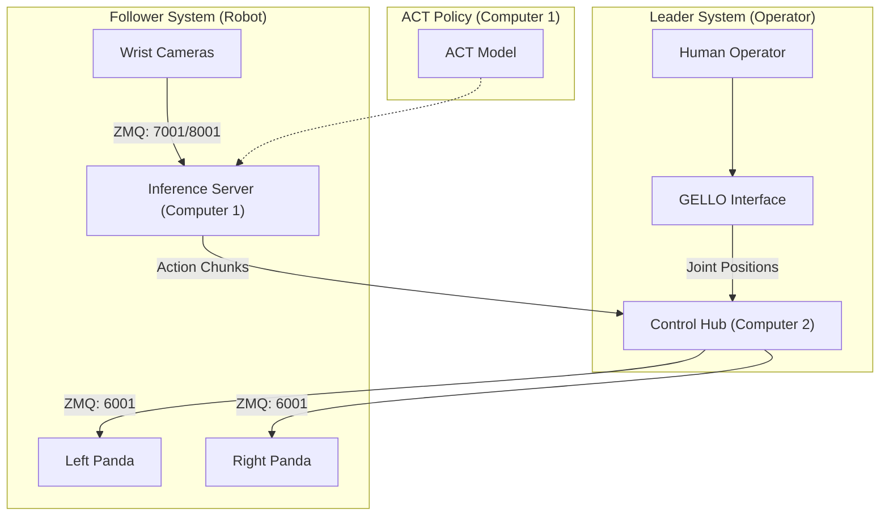

# ACT-panel-maintenance: Manipulation for Energy Facility Management

**Project:** GIST, ETRI

## Abstract
This project implements a robust bimanual teleoperation and imitation learning system for maintaining high-voltage energy facilities. Utilizing a **Leader-Follower** architecture with **Franka Emika Panda** robots and **GELLO** interfaces, the system achieves **>90% success rates** across three critical maintenance tasks: Panel Opening, Switch Operation, and Voltage Checking. The core control policy is trained using **Action Chunking with Transformers (ACT)**, enabling precise and resilient manipulation.


## Demo Highlights

### ⚡ Switch Off
<div align="center">
  
</div>

### 🚪 Panel Opening
<div align="center">
  
</div>

### 🔋 Voltage Check
<div align="center">
  
</div>

## System Architecture

The system operates on a distributed architecture across three compute nodes, synchronized via **ZeroMQ**.



### Hardware Setup
- **Robots:** 2x Franka Emika Panda (7-DoF)
- **Teleoperation:** 2x GELLO (Dynamixel-based 1:1 mapping)
- **Vision:** 
  - 2x Wrist Cameras (Logitech/RealSense) for Policy Inputs
  - 1x Head Camera for Monitoring
- **Compute:** 
  - **Node 1 (AI Server):** ACT Training & Inference (RTX 3090/4090)
  - **Node 2 (Control Hub):** Robot Drivers, ZMQ Servers, Data Collection
  - **Node 3 (Auxiliary):** Right Arm Polymetis Server


## Installation

### 1. Clone the Repository
```bash
git clone https://github.com/your-org/ACT-panel-maintenance.git
cd ACT-panel-maintenance
```

### 2. Environment Setup
We provide a unified requirements file. It is recommended to use Conda.

```bash
conda create -n act_maintenance python=3.9
conda activate act_maintenance
pip install -r requirements.txt
```

### 3. Key Dependencies
- `torch >= 2.0.0`
- `dm_control` (Mujoco bindings)
- `gello` (included in `gello/` directory)
- `act` (included in `act/` directory)


## Usage

### Inference (Autonomous Mode)
To run the trained policy:
```bash
python act/panda_inference.py --task_name switch_off --ckpt_dir checkpoints/switch_off
```

### Teleoperation (Data Collection)
To manipulate the robot using GELLO:
```bash
python gello/scripts/run_env.py --agent gello --bimanual --use_webcam
```

## Results

The system was evaluated on 3 tasks, with 20 trials each. A trial is considered successful if completed without collision or intervention.

| Task | Trials | Successes | Success Rate |
| :--- | :---: | :---: | :---: |
| **Switch Off** | 20 | 18 | **90%** |
| **Open Panel** | 20 | 20 | **100%** |
| **Voltage Check** | 20 | 18 | **90%** |
